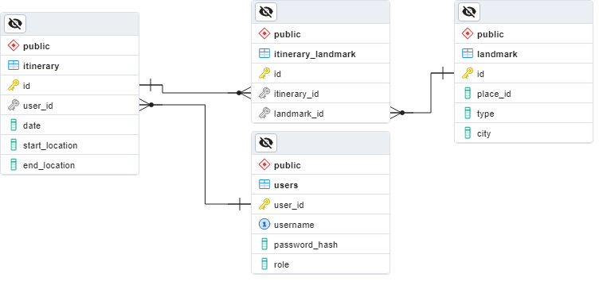

# City Tours - WIP
​City Tours is a planning/organization web app that allows users to search a locale for landmarks, restaurants, and other places of interest. A registered user can add their favorites to an itinerary and generate a travel route.

This project was created using Java, Spring Boot, and PostgreSQL for the back end API and Vue.js for the front end as a Tech Elevator alumni project. It makes use of the Google Maps API for search functions and landmark data retrieval.

Project partners:
- [ahdisease](https://github.com/ahdisease)
- [hp-plus5](https://github.com/hp-plus5)
- [kubra90](https://github.com/kubra90)
- [s-sandlin](https://github.com/s-sandlin)

## Schema
See the Entity Relationship Diagram below:



## API Routes
The following actions are available using the API

| HTTP Method | Enpoint URL | Description | Status Code | Returned Value |
| :---: | :---: | :--- | :---: | :--- |
| **POST** | '/register' | Register a user. | 201 | |
| **POST** | '/login' | Request a JWT for authorization. | 200 | ``` { token, user: {id, username, authorities:[ { name } ] } ``` |
||||401||
| **GET** | '/itineraries/all' | Retrieve all itineraries for current user. | 200 | ``` [{ id, user, date, startLocation, endLocation, landmarks: [ int... ] }, ...] ``` or ``` [] ``` |
||||401||
| **GET** | '/itineraries' | Retrieve current user's next itinerary. | 200 | ``` { id, user, date, startLocation, endLocation, landmarks: [ int... ] } ``` |
||||401, 404||
| **GET** | '/itineraries?date=`{MMddyyyy}`' | Retrieve current user's itinerary for `date`. | 200 | ``` { id, user, date, startLocation, endLocation, landmarks: [ int... ] } ``` |
||||401, 404||
| **GET** | '/itineraries/`{id}`' | Retrieve itinerary with `id`. Only available to ADMIN role.| 200 | ``` { id, user, date, startLocation, endLocation, landmarks: [ int... ] } ``` |
|||| 403, 404 ||
| **POST** | '/itineraries' | Create itinerary for current user.| 201 | |
| **PUT** | '/itineraries' | Update itinerary owned by current user.| 201 | |
|||| 401 ||
| **GET** | '/landmarks?city=`{city}`' | Retrieve all stored landmarks in `city`.| 200 | ```[ { id, placeId, type, city }, ... ]``` or ```[]``` |
| **GET** | '/landmarks?type=`{type}`' | Retrieve all stored landmarks of `type`. | 200 | ```[ { id, placeId, type, city }, ... ]``` or ```[]``` |
| **GET** | '/landmarks?type=`{type}`&city=`{city}`' | Retrieve all stored landmarks of `type` in `city`. | 200 | ```[ { id, placeId, type, city }, ... ]``` or ```[]``` |
| **GET** | '/landmarks/`{placeId}`' | Retrieve landmark with `placeId`. | 200 | ``` { id, placeId, type, city } ``` |
|||| 404 ||
| **POST** | '/landmarks' | Create landmark in database | 201 | |


## Map Search and Route Generation
*To Be Added*

## Itinerary Creation and Navigation
*To Be Added*